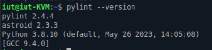

# MS103 LODI Ylan

### création utilisateur lodi0003
On veut créé l'utilisateur lodi0003 tel quel son uid soit 3307, son gid soit 1041 et que son répertoire d'accueil soit /home/lodi0003 et ayant pour mot de passe ec4e01e5. 
Le groupe ayant pour id 1041 n'éxistant pas, on commence par le créere on le nomme arbitrairement "groupe1041" 
Pour créer l'utilisateur lodi0003 on utilise la commande **"adduser"** avec les options **--home** pour spécifier le répertoire d'accueil, **--id** pour forcer l'uid de l'utilisateur à la valeur souhaitée, **--gid** pour forcer le groupe principal.  
On a donc les commande suivante:  
  
On entre par la suite le mot de passe de l'utilisateur.
On peut consulter l'id de l'utilisateur et de ces groupes en utilisant la commande **id lodi0003**
On a donc la création de l'utilisateur lodi0003 ayant pour uid 3307 et ayant pour groupe principal le groupe d'id 1041.
  

### création utilisateur administrateur
On veut créé l'utilisateur admin tel quel son uid soit 533, son gid soit 2524, appartenant au groupe sudo et que son répertoire d'accueil soit /home/admin533 et ayant pour mot de passe af032fbc. 
Le groupe ayant pour id 2524 n'éxistant pas, on commence par le créer avec la commande :  
  
On le nomme arbitrairement group2524  
Pour créer l'utilisateur admin on utilise la commande **"adduser"** avec les options **--home** pour spécifier le répertoire d'accueil, **--firstuid** pour forcer l'uid de l'utilisateur à la valeur souhaitée, **--gid** pour forcer le groupe principal 
On a donc les commande suivante:
  
on observe dans les dernières lignes que le mot de passe n'as pas été enregistré, on le modifie avec la commande :  
  
en éxécutant la commande **id amin** on se rend compte que l'uid et le gid sont correctement attribués mais qu'il manque le groupe sudo (première éxécution ci-dessous) :  
  
On l'ajoute au groupe sudo à l'aide de la commande : **sudo adduser admin sudo** ; ensuite, en rééxécutant la commande **id admin**, on observe que le groupe sudo appartient désormais aux groupes de l'utilisateur admin.    
### Outils
####python 3 
##### formateur de code source
**Black** est un formateur de code source, un formateur de code source permet de mettre en forme un fichier selon les normes, ici ce sont les normes PEP que black respecte, on peut l'installer en utilisant la commande:
**sudo apt install black**  
On constate que l'installation de black et ses dépendance à été un succès:  
  
Pour vérifier son fonctionnement, on écrit un programme fonctionnel mais qui ne respecte pas les recommandations de mise en page PEP, comme ceci :  
  
on utilise black pour remettre en ordre le programme à l'aide de la commande :  
**python3 -m black fichier**  
Dans notre cas, on entre la commande avec fichier : __./fonctionBlack.py__ car le terminal est ouvert dans le répertoire où se situe le fichier que l'on veut tester, on obtient alors le résultat ci-dessous :  
  
Notre programme rentre alors dans les normes de la PEP selon la version installé de black (si black est installé dans une ancienne version, notre programme sera aux norme d'une ancienne version de la PEP).
##### analyseur statique de code 
**pylint** est un analyseur statique de code, un analyseur statique de code permet de trouver des erreurs dans le code, vérifier la mise en forme, s'assurer de la visibilité, on peut l'installer en utilisant la commande :
**sudo apt install pylint**  
On constate que l'installation à été un succès :  
  
Pour vérifier son fonctionnement, on écrit un programme fonctionnel mais mais contenant des aberrations de mise en page (variable en toute majuscule,mise en page incorrecte), comme ci-dessous à gauche :  
  
A drpite, on à utilisé la commande **python3 -m pylint fichier**  
Dans notre cas, on entre la commande avec fichier : __./fonctionBlack.py__ pour les même raison que l'utilisation de black.
On observe que pylint nous indique les erreurs de mise et forme mais ne modifie pas le fichier, il nous indique ce qui ne vas pas par rapports aux normes, et c'est à nous de corriger notre programme.

##### outil de vérification d’annotations de type
##### outil de génération de documentation HTML à partir de docstrings
##### cadriciel de tests unitaires 
##### pygames
