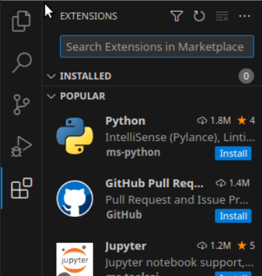

# MS103 LODI Ylan

### création utilisateur lodi0003
On veut créé l'utilisateur lodi0003 tel quel son uid soit 3307, son gid soit 1041 et que son répertoire d'accueil soit /home/lodi0003 et ayant pour mot de passe ec4e01e5. 
Le groupe ayant pour id 1041 n'éxistant pas, on commence par le créere on le nomme arbitrairement "groupe1041" 
Pour créer l'utilisateur lodi0003 on utilise la commande **"adduser"** avec les options **--home** pour spécifier le répertoire d'accueil, **--id** pour forcer l'uid de l'utilisateur à la valeur souhaitée, **--gid** pour forcer le groupe principal.  
On a donc les commande suivante:  
  
On entre par la suite le mot de passe de l'utilisateur.
On peut consulter l'id de l'utilisateur et de ces groupes en utilisant la commande **id lodi0003**
On a donc la création de l'utilisateur lodi0003 ayant pour uid 3307 et ayant pour groupe principal le groupe d'id 1041.
  

### création utilisateur administrateur
On veut créé l'utilisateur admin tel quel son uid soit 533, son gid soit 2524, appartenant au groupe sudo et que son répertoire d'accueil soit /home/admin533 et ayant pour mot de passe af032fbc. 
Le groupe ayant pour id 2524 n'éxistant pas, on commence par le créer avec la commande :  
  
On le nomme arbitrairement group2524  
Pour créer l'utilisateur admin on utilise la commande **"adduser"** avec les options **--home** pour spécifier le répertoire d'accueil, **--firstuid** pour forcer l'uid de l'utilisateur à la valeur souhaitée, **--gid** pour forcer le groupe principal 
On a donc les commande suivante:
  
on observe dans les dernières lignes que le mot de passe n'as pas été enregistré, on le modifie avec la commande :  
  
en éxécutant la commande **id amin** on se rend compte que l'uid et le gid sont correctement attribués mais qu'il manque le groupe sudo (première éxécution ci-dessous) :  
  
On l'ajoute au groupe sudo à l'aide de la commande : **sudo adduser admin sudo** ; ensuite, en rééxécutant la commande **id admin**, on observe que le groupe sudo appartient désormais aux groupes de l'utilisateur admin.    
### Outils
####  python 3 
##### formateur de code source
**Black** est un formateur de code source, un formateur de code source permet de mettre en forme un fichier selon les normes, ici ce sont les normes PEP que black respecte, on peut l'installer en utilisant la commande:
**sudo apt install black**  
On constate que l'installation de black et ses dépendance à été un succès:  
  
Pour vérifier son fonctionnement, on écrit un programme fonctionnel mais qui ne respecte pas les recommandations de mise en page PEP, comme ceci :  
  
on utilise black pour remettre en ordre le programme à l'aide de la commande :  
**python3 -m black fichier**  
Dans notre cas, on entre la commande avec fichier : __./fonctionBlack.py__ car le terminal est ouvert dans le répertoire où se situe le fichier que l'on veut tester, on obtient alors le résultat ci-dessous :  
  
Notre programme rentre alors dans les normes de la PEP selon la version installé de black (si black est installé dans une ancienne version, notre programme sera aux norme d'une ancienne version de la PEP).
##### analyseur statique de code 
**pylint** est un analyseur statique de code, un analyseur statique de code permet de trouver des erreurs dans le code, vérifier la mise en forme, s'assurer de la visibilité, on peut l'installer en utilisant la commande :
**sudo apt install pylint**  
On constate que l'installation à été un succès :  
  
Pour vérifier son fonctionnement, on écrit un programme fonctionnel mais contenant des aberrations de mise en page (variable en toute majuscule,mise en page incorrecte), comme ci-dessous à gauche :  
  
A droite, on à utilisé la commande **python3 -m pylint fichier**  
Dans notre cas, on entre la commande avec fichier : __./fonctionPylint.py__ pour les même raison que l'utilisation de black.
On observe que pylint nous indique les erreurs de mise et forme mais ne modifie pas le fichier, il nous indique ce qui ne vas pas par rapports aux normes, et c'est à nous de corriger notre programme.
Pour vérifier son fonctionnement, on écrit un programme fonctionnant qu'avec certains type, comme ci-dessous par exemple  : 

##### outil de vérification d’annotations de type
**mypy** est un outil de vérification d'annotation de type, il permet d'ajouter des contraintes sur des variables, paramètres de fonctions, on peut l'installer en utilisant la commande :
**sudo apt install mypy**  
On constate que l'installation à été un succès :  
  
Pour vérifier son fonctionnement, on écrit un programme pour lesquels on doit avoir une restriction sur les paramètres d'une fonction ou sur le retour :  
  
ici la restriction est principalement sur le paramètre _numero_ qui correspond à un numéro de téléphone, on demande une chaine de caractère _(numero:str)_ pour pouvoir renvoyer une chaine de caratère, si numéro est un entier, une erreur se produira, on anticipe ce problème en imposant le type du paramètre en question.

##### outil de génération de documentation HTML à partir de docstrings
**pydoc** est un outil de génération de document à partir de la docstring, il permet d'afficher les docstring, et d'autres objets, on peut l'installer en utilisant la commande : 
**pip install pydocs**  
On constate que l'installation est un succès:  

Pour vérifier  son fonctionnement, on écrit un script contenant plusieurs fonctions, des variables seules et autre.
on utilise la commande **python3 -m pydoc ./fonctionEpydoc.py**. Ci-dessous, à gauche se trouve le script, et à droite le résultat de la commande énoncé ci-avant.
 
On peut par la suite enregistrer ce fichier en format html en procédant de cette manière:  
**python3 -m unitest cheminfichier > nomfichier.html**  

##### cadriciel de tests unitaires 
**unittest** est un cadriciel permettant de réaliser des tests unitaires, il permet de vérifier, en fonction des entrées fournies à l’unité du module, que la sortie corresponde aux spécifications de l’unité, il est déjà intégré dans python,
on peut le constater gràce à la commande :
**python3 -m unittest cheminfichier**  
Pour vérifier son fonctionnement on écrit le programme suivant (à droite):  

On teste les valeurs de _test_values_ sont, par le biais de la fonction carré bel et bien le carré d'un autre nombre. Ici on test pour 5 et 20, or 20 n'est pas le carré de 5, unittest nous renvoie donc une erreur et nous précise que 5 au carré vaut 25.
unittest nous indique _FAIL_ comme quoi les tests ne sont pas tous correscts, si ça aurait été le cas, _OK_ aurait été indiqué.

##### pygames
**pygames** est un module permettant la création de jeu sur python, on l'installe avec la commande : 
**sudo apt install python-pygames**
Pour vérifier son fonctionnement, on écrit un programme basique nécessitant le module. On va donc l'importer dans notre programme. Ci-dessous, il y a le programme python, la commande et son résultat:  
  
le preogramme intitulé "testPygame.py" permet la création d'une fenêtre graphique de couleur rgd(10,186,180); en bas de l'image, on a la commande permettant d'éxécuté le programme précédant soit la commande : **python ./testPygame.py**. Son résultat est l'arrière plan, dimensionné tel que dans le script et de couleur souhaité.

#### Outils de base pour le développement avec le langage Java 
Pour installer Java on utilise la commande **sudo apt install default-jre**  

java à besoin des JDK (kit de developpement Java) pour fonctionner, on éxécute la commande : **sudo apt install default-jdk**. 
Pour vérifier son fonctionnement, on peut écrire le scripte ci-dessous (en haut) :
  
on compile le programme avec la commande **javac Hello.java**
puis on l'éxécute avec la commande **java Hello**, on observe que ce qui est affiché correspond à ce qui est attendu.
#### VSCodium
VScodium est un éditeur de code open-source gratuit, il permet de debugger, respecter la syntaxe des normes des langages....
On l'installe avec la commande : **sudo snap install codium --classic**  
  
On ouvre vs codium en entreant la commande **codium** dans le terminal, l'application s'ouvre par la suite.  
On veut installer des extensions pour l'utilisateur lodi0003, on change alors d'utilisateur avec la commande **su lodi0003**  
  
Pour installer des extensions sur VSCodium on peut utiliser les extensions du MarketPlace de vsCodium (voir ci-dessous) :  
  
On souhaite installée une extension python, une extension permettant de débogger le code peut s'avérer très utile pour avoir des indications concernant les problèmes dans le code, pour cela on peut rechercher dans le marketplace des extensions par mots clés. On installe l'extension suivant nos besoins, nous choississons :  
 et nous l'installons.  
Nous testons par la suite le bon fonctionnement de notre extension, ci-dessous un programme contenant une erreur éxécuté sans débogage:  
  
Et avec débogage :  
  
On observe qu'avec le débogage de notre extension, l'erreur apparait plus clairement et il est par la suite plus facile de corriger les erreurs de code.

